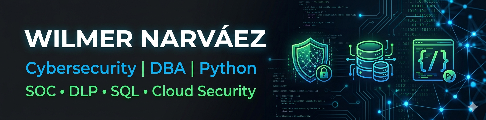

  

# 👋 Hola, soy Wilmer Narváez

### 🔐 Analista de Seguridad | SOC | DBA | Python Developer en formación

Soy un profesional de TI enfocado en **Ciberseguridad, Bases de Datos y Automatización**.

Actualmente trabajo como **Analista de Seguridad y DBA**, donde participo en actividades relacionadas con:

* 🔍 Monitoreo y análisis de eventos de seguridad
* 🛡️ DLP (Data Loss Prevention)
* 📊 Administración de Bases de Datos
* 🚨 Gestión de Incidentes
* 🤖 Automatización con Python
* ☁️ Seguridad en la nube

Mi objetivo es evolucionar hacia roles especializados en:

* Cybersecurity Engineering
* DevSecOps
* Cloud Security
* Threat Hunting
* Security Automation

---

## 🚀 Tecnologías y Herramientas

### Seguridad

### Bases de Datos

### Programación

### Sistemas Operativos

### DevOps

---

## 📚 Actualmente Aprendiendo

* Python para Ciberseguridad
* SQL
* DevSecOps
* HashiCorp Vault
* Docker
* SC-900

---

## 🏆 Certificaciones

* 📖 CompTIA Security+ (En preparación)
* 📖 Microsoft SC-900 (En preparación)
* 📖 Google Cloud Digital Leader (En preparación)
* 📖 PCNSA Palo Alto (En preparación)

---

## 📂 Proyectos del Portafolio

### 🔐 Cybersecurity

* Mini SIEM en Python
* Monitor de Integridad de Archivos (FIM)
* Threat Intelligence Collector
* Analizador de Logs
* Dashboard de Incidentes

### 🗄️ Bases de Datos

* Dashboard de Auditoría SQL
* Sistema de Gestión de Incidentes
* Monitoreo de Bases de Datos

### 🤖 Automatización

* Scripts de Hardening
* Automatización de Reportes
* Integración Python + SQL

---

## 📈 Estadísticas GitHub

---

## 📫 Contacto

* LinkedIn: https://www.linkedin.com/in/wilmer-rafael-narvaez21
* Correo: [wilmer-endo@hotmail.com](mailto:wilmer-endo@hotmail.com)

---

### ⚡ Frase Profesional

> "La seguridad no es un producto, es un proceso continuo de mejora."
